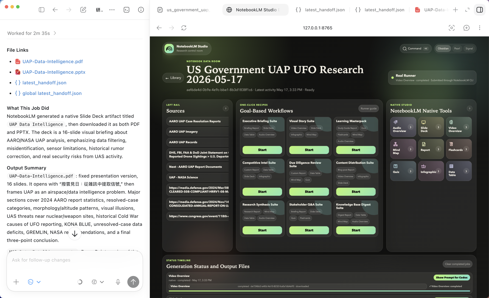
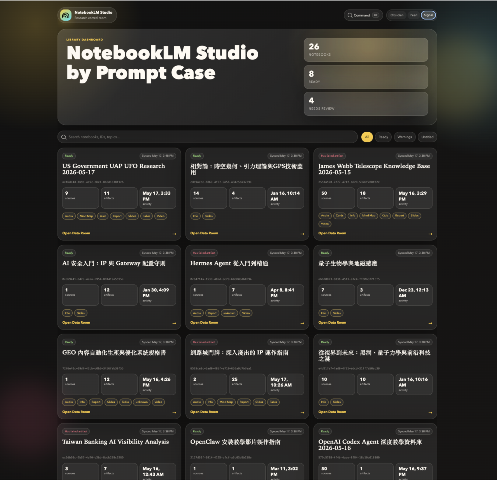
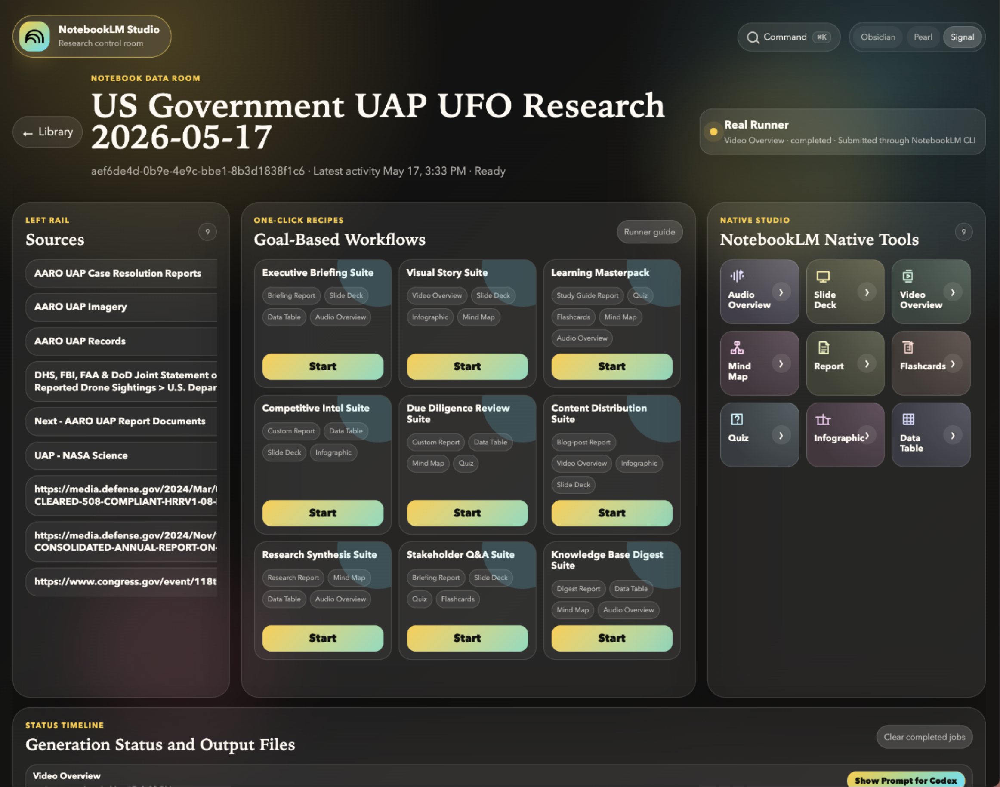
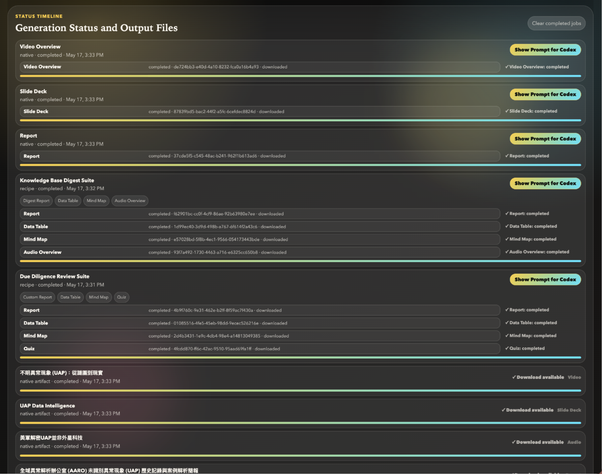
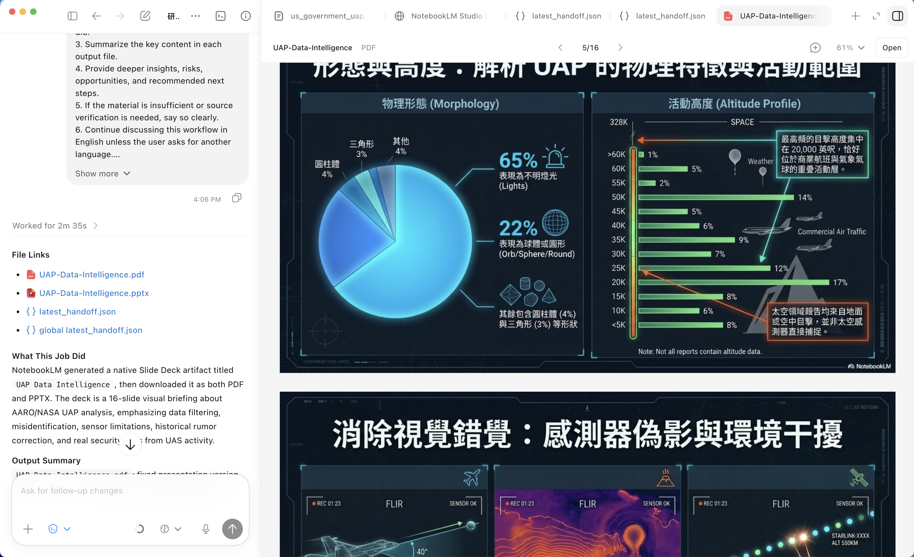

# NotebookLM Studio Skill


[English README](README.md)

把 Codex 變成你的 NotebookLM 研究助理：協助整理來源、建立 NotebookLM 筆記本、生成 NotebookLM Studio 內容，並把結果下載到本地，方便繼續用 Codex 分析、改寫、整理或製作輸出。

> 這是一個為 AI agent 工作流設計的 NotebookLM 輔助 Skill。它不是取代 NotebookLM，而是把 NotebookLM 接到 Codex 的研究、寫作、學習和內容製作流程裡。

---

## 這個 Skill 可以做什麼？

NotebookLM Studio Skill 可以幫你把資料變成完整研究工作流：

- 建立或重用 NotebookLM 筆記本
- 整理並加入 NotebookLM 支援的來源，例如網頁、PDF、文件、簡報、表格、音訊、影片和圖片
- 觸發 NotebookLM Studio 生成內容
- 下載生成結果到本地資料夾
- 建立 handoff 檔案，讓 Codex 可以直接讀取並分析
- 啟動本地 Dashboard 操作面板
- 把 NotebookLM Mind Map 轉成可互動 HTML
- 將 NotebookLM 生成結果整理成報告、教學、簡報大綱、內容策略或研究摘要

簡單來說：

```text
資料來源
→ NotebookLM 筆記本
→ NotebookLM Studio 生成內容
→ 本地下載
→ Codex 分析、整理、二次創作
```

---

## 操作畫面

### Codex + NotebookLM Studio 並排工作流



Codex 可以在左邊讀取 handoff、分析 NotebookLM 生成結果；NotebookLM Studio Dashboard 則在右邊負責管理筆記本、來源、recipes 和生成任務。

### Notebook Library



Library 畫面用來快速瀏覽所有 NotebookLM 筆記本，包括來源數量、已生成 artifact、最近活動時間和狀態。

### Notebook Data Room



Data Room 是單一 notebook 的工作台：左側是來源，中間是 goal-based workflows，右側是 NotebookLM 原生工具。適合從同一批資料出發，快速生成報告、簡報、影片概覽、Mind Map、Quiz 或資料表。

### One-Click Workflows

Data Room 中間的 One-Click Workflows 會把常見研究任務包成一鍵流程。你不用逐個 artifact 手動生成，只要選擇目標，Skill 會按流程建立一組合適的 NotebookLM 輸出。

| Workflow | 適合用途 |
| --- | --- |
| Executive Briefing Suite | 為決策者快速生成 briefing report、slide deck、data table 和 audio overview。 |
| Visual Story Suite | 把資料變成視覺敘事，適合 video overview、slide deck、infographic 和 mind map。 |
| Learning Masterpack | 建立學習套裝，包含 study guide、quiz、flashcards、mind map 和 audio overview。 |
| Competitive Intel Suite | 整理競爭情報，輸出 custom report、data table、slide deck 和 infographic。 |
| Due Diligence Review Suite | 做審查和盡職調查，生成 custom report、data table、mind map 和 quiz。 |
| Content Distribution Suite | 把研究內容拆成可發布素材，例如 blog report、video overview、infographic 和 slide deck。 |
| Research Synthesis Suite | 將多來源資料整合成 research report、mind map、data table 和 audio overview。 |
| Stakeholder Q&A Suite | 為會議和簡報準備 briefing report、slide deck、quiz 和 flashcards。 |
| Knowledge Base Digest Suite | 把知識庫壓縮成 digest report、data table、mind map 和 audio overview。 |

### Job Timeline 與 Codex Handoff



Timeline 會追蹤每個生成任務的狀態、artifact 類型、下載結果和後續交給 Codex 分析的入口。

### 生成結果預覽：Slide Deck / PDF / Codex 分析



NotebookLM 生成的 Slide Deck 或 PDF 可以下載到本地，並和 Codex 的分析結果並排查看。這讓你不只拿到 artifact，也能立刻請 Codex 檢查重點、整理結論、指出風險與提出下一步建議。

---

## 和直接使用 NotebookLM 有什麼不同？

NotebookLM 官方已經可以接收很多格式，也可以生成很多內容。這個 Skill 的價值不是重做 NotebookLM 已經做得很好的事，而是補上「工作流」。

| 需求 | 直接使用 NotebookLM | 使用這個 Skill |
| --- | --- | --- |
| 建立筆記本 | 手動操作 | 由 Codex 協助建立 |
| 加入多個來源 | 手動逐個加入 | 可批量整理、檢查、加入 |
| 生成內容 | 手動點選 | 可用提示詞或 Dashboard 觸發 |
| 下載結果 | 手動處理 | 自動下載到本地 |
| 交給 Codex 分析 | 需要自己複製整理 | 自動產生 handoff 檔案 |
| Mind Map JSON | 原始 JSON | 可轉成互動 HTML |
| 研究流程追蹤 | 手動記錄 | job timeline + manifest |
| 多步驟研究任務 | 人手串接 | Codex + NotebookLM 串接 |

你可以把 NotebookLM 想成「很會讀資料的研究模型」，而這個 Skill 是「幫你整理資料、按流程操作、下載結果、交回 Agent 的研究助理」。

---

## 安裝方式

你可以用以下其中一種方式安裝這個 Skill。

### 方法一：使用 `npx skills add`

如果你的 Agent 或 Skills 管理工具支援 `skills add`，可以直接安裝：

```bash
npx skills add Toolsai/notebooklm-studio-Skill
```

這是最簡單的安裝方式，適合已經使用 Skills 工作流的人。

### 方法二：使用 `git clone`

你也可以用傳統方式下載：

```bash
git clone https://github.com/Toolsai/notebooklm-studio-Skill.git
```

然後把下載後的資料夾放到你的 Agent 可以讀取 Skills 的位置。建議安裝時把目標資料夾命名為 `notebooklm-studio`，這樣之後呼叫 Skill 時會更清楚。

以 Codex 常見的本地 Skills 目錄為例：

```bash
mkdir -p ~/.codex/skills
cp -R notebooklm-studio-Skill ~/.codex/skills/notebooklm-studio
```

如果你使用 Claude Code，常見的本地 Skills 目錄是：

```bash
mkdir -p ~/.claude/skills
cp -R notebooklm-studio-Skill ~/.claude/skills/notebooklm-studio
```

如果你使用的是其他 Agent，請把資料夾放到該工具指定的 Skills 目錄。

---

## 快速開始

安裝完成後，在 Codex 裡輸入：

```text
Initiate /notebookLM studio
```

或用中文：

```text
初始化 /notebookLM studio
```

Agent 會根據 Skill 的指引檢查環境、確認 NotebookLM 是否可用，並引導你完成 Google 登入或授權流程。登入與安全驗證需要由使用者本人完成。

---

## 啟動 Dashboard 操作面板

你可以對 Agent 說：

```text
Launch the NotebookLM Studio dashboard.
```

或中文：

```text
幫我啟動 Dashboard 操作面板。
```

啟動後，Agent 會提供一個本地網址，例如：

```text
http://localhost:8765/
```

如果預設 port 已被使用，會改用下一個可用 port，並告訴你實際網址。

---

## 常用提示詞

### 建立研究筆記本

```text
使用 /notebookLM studio 建立一個新的 NotebookLM 筆記本，名稱叫「AI Agent Research Pack」，把以下 URL 加入來源，生成 Report 和 Mind Map，下載結果後幫我分析。
```

### 把來源變成學習包

```text
使用 /notebookLM studio 把這些來源變成學習包：Report、Quiz、Flashcards、Mind Map。完成後下載所有檔案並幫我整理重點。
```

### 生成簡報

```text
用 /notebookLM studio 從這個 NotebookLM 筆記本生成 Slide Deck，如果可以就下載 PDF 和 PPTX，然後幫我整理簡報大綱。
```

### 生成 Audio Overview

```text
用 /notebookLM studio 幫這個筆記本生成 Audio Overview，下載後告訴我內容涵蓋哪些主題。
```

### 生成 Mind Map 並轉成 HTML

```text
幫我生成 NotebookLM Mind Map，下載 JSON，並轉成互動式 HTML，最後給我兩個檔案連結。
```

### 搜尋資料並建立 NotebookLM

```text
幫我搜尋 OpenAI Codex Agent 最可靠的教學來源，優先官方文件和高品質教學，建立新的 NotebookLM 筆記本，加入來源，然後用 NotebookLM 生成一份深入教學報告。
```

---

## 支援的 NotebookLM Studio 內容

| 類型 | 用途 |
| --- | --- |
| Report | 簡報、study guide、blog post、custom report |
| Mind Map | 概念圖，可轉互動 HTML |
| Audio Overview | Podcast-style audio summary |
| Video Overview | NotebookLM video summary |
| Slide Deck | 簡報 deck |
| Infographic | 圖像摘要 |
| Quiz | 測驗題 |
| Flashcards | 學習卡 |
| Data Table | 結構化表格 |

---

## 支援的來源

這個 Skill 會優先使用 NotebookLM 官方支援的來源格式，例如 PDF、TXT、Markdown、DOCX、CSV、PPTX、EPUB、音訊、影片和圖片。

它的主要角色是補上來源整理、匯入檢查、生成任務追蹤、結果下載、handoff 和後續 Codex 分析流程。

---

## 適合的使用場景

### 研究助理

```text
找來源 → 建 NotebookLM → 生成 Report → Codex 做深度分析
```

### 學習教練

```text
課程資料 → Study Guide → Quiz → Flashcards → Codex 幫你設計練習
```

### 內容工廠

```text
來源資料 → NotebookLM Report / Mind Map → Codex 改寫成文章、短片腳本、簡報
```

### 團隊知識庫

```text
Docs / PR / Meeting notes → NotebookLM → Data Table / Summary / Action Plan
```

---

## 相容性

這個 Skill 目前以 Codex 工作流為主要設計目標，尤其適合需要本地檔案讀寫、Dashboard 操作、handoff 分析和多步驟研究流程的使用方式。

其他支援 Skills 或本地工具調用的 Agent 可以參考這個專案的概念，但實際使用時可能需要按各自平台調整。

---

## 安全與使用界線

請只在你有權使用的資料、帳戶和內容上使用本專案。

- 不要用來繞過 paywall、DRM、登入牆、私人存取控制或內容限制
- 不要把私人登入資料、session、token 或本地輸出中的敏感資料提交到 GitHub
- Google 登入與安全驗證應由使用者本人完成
- NotebookLM 是 Google 產品，本專案與 Google 無從屬、合作或背書關係

---

## License

This project is licensed under the MIT License.
